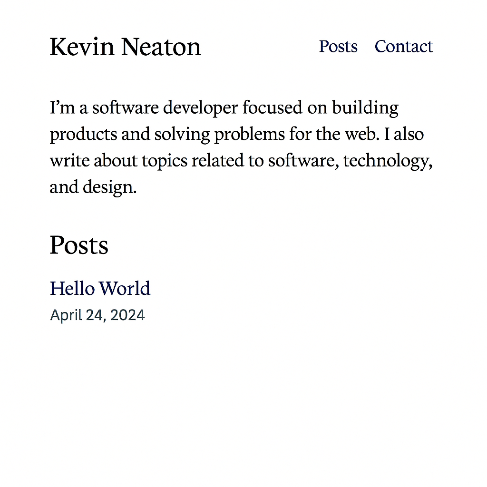

# Design

A thoughtful, book-inspired design system for developer-essayists—minimal,
timeless, and focused on clarity and immersive reading. Every detail prioritizes
content and typographic excellence.

---

## 1. Visual Intent

- **Tone:** Thoughtful, timeless, book-like.
- **Purpose:** Provide an uncluttered stage for long-form writing and clear navigation, with zero distractions.

## 2. Color Palette

- **Background:** background (white)
- **Primary Text:** foreground (black)
- **Link Color:** foreground, underlined by default
- **Link Hover/Focus:** foreground with opacity-90
- **Metadata (dates, bylines):** foreground/60 (60% opacity)

## 3. Typography

1. **Base Font Stack:**

   - Primary: _Source Serif Pro_ (serif for body text)
   - Fallbacks: Georgia, “Times New Roman”, serif

2. **Heading Stack:**

   - _Inter_ (sans-serif for navigation, bylines)
   - Fallbacks: system-ui, sans-serif

3. **Sizing & Hierarchy:**

   - **H1 (Site title on landing):** text-4xl leading-tight
   - **H2 (Post titles):** text-2xl leading-snug
   - **Body:** text-base leading-relaxed
   - **Metadata (date, author):** text-sm leading-normal

4. **Typographic Features:**

   - **Hyphenation:** Enabled for narrow viewports (`hyphens-auto`), disabled for wider screens (`hyphens-none`).
   - **Text wrap:** Optimal measure (~65–75 characters) using `max-w-prose`.
   - **Paragraph spacing:** Margin-bottom 1em (`mb-4`); no first-paragraph indent (`indent-4 first:indent-0`).
   - **Accessible link underlines:** Always underlined with increased thickness and offset (`underline decoration-2 underline-offset-4`).

## 4. Branding Asset Placement Strategy

- **Photo:** Omit on landing; instead, use a tiny circular avatar (32px) next to the byline on individual posts.
- **Logo/Text mark:** Represent yourself by name in the header (H1) on landing; no separate graphic.

## 5. Layout & Composition

- **Responsive Grid:**

  - **Single column** on mobile (padding 1rem).
  - **Centered column** on tablet/desktop, max-width 680px, auto margins.

- **Header:**

  - Landing: H1 at top-left, nav links (“Posts” / “Contact”) in same line, spaced with em units.
  - Post pages: A back-caret link (“← Posts”) in sans-serif, 1rem, top-left.

- **Spacing Rhythm:**

  - 2rem above H1; 1.5rem below; 2rem before any H2; 1rem before body text.

- **Visual Anchors:**

  - **Landing:** H1 → intro blurb → latest posts list.
  - **Post:** Back link → date/author line → H2 title → body text.

## 6. Special Treatments

- **Images:** Only used if integral to an essay; otherwise hidden.
- **Code Blocks:** Monospaced, 0.9rem, light gray background (#F3F4F6), 1px radius corners, horizontal scroll only when needed.
- **Blockquotes:** Italic serif text, left border 4px solid #E5E7EB, padding-left 1rem.
- **Focus Styles:** All interactive elements get a 3px outline in the link hover color.
- **Print Stylesheet:** Remove navigation, adjust max-width to 700px, black text on white, hide code backgrounds.

## 7. Vertical Rhythm Guidelines

To ensure a harmonious and readable layout, use the following vertical rhythm rules throughout the site:

- **H1:**
  - `mt-8` (2rem top margin)
  - `mb-6` (1.5rem bottom margin)
- **H2:**
  - `mt-8` (2rem top margin)
  - `mb-4` (1rem bottom margin)
- **Body text (p):**
  - `mb-4` (1em or 1rem bottom margin)
  - No first-paragraph indent (`first:indent-0`)
- **Section spacing:**
  - `mt-8` (2rem) before major sections (e.g., before H2)
  - `mb-4` (1rem) before body text
- **Lists and other blocks:**
  - Use `gap-6` or `mb-6` for vertical spacing between items
- **General:**
  - Use Tailwind spacing utilities (`mb-4`, `mt-8`, etc.) to maintain consistency
